# TheMeals

## About
It simply loads data from API and stores it in persistence storage (i.e. SQLite Database).
* User real [TheMealDB](https://www.themealdb.com/) api. 
* Clean and Simple Material UI. 
* Use convention plugins. 
* Use multi-module Gradle architecture. 

## Built With 🛠
[Kotlin](https://kotlinlang.org/) - First class and official programming language for Android development. 
[Kotlin Gradle DSL](https://docs.gradle.org/current/userguide/kotlin_dsl.html) - Provides an alternative syntax to the traditional Groovy DSL for Gradle build system.  
[Coroutines](https://kotlinlang.org/docs/reference/coroutines-overview.html) - For asynchronous and more.. 
[Flow](https://kotlin.github.io/kotlinx.coroutines/kotlinx-coroutines-core/kotlinx.coroutines.flow/-flow/) - A cold asynchronous data stream that sequentially emits values and completes normally or with an exception. 
[Compose](https://developer.android.com/develop/ui/compose/documentation) - The modern toolkit for building native Android UI. 
[ViewModel](https://developer.android.com/topic/libraries/architecture/viewmodel) - Stores UI-related data that isn't destroyed on UI changes. 
[Jetpack Navigation](https://developer.android.com/guide/navigation) - Component helps you implement navigation. 
[Room](https://developer.android.com/topic/libraries/architecture/room) - SQLite object mapping library. 
[Koin](https://insert-koin.io) - The pragmatic Kotlin Dependency Injection framework. 
[Retrofit](https://square.github.io/retrofit/) - A type-safe HTTP client for Android and Java. 
[Kotlin Serialization](https://kotlinlang.org/docs/serialization.html) - A modern JSON library for Kotlin and Java. 
[MockWebServer](https://github.com/square/okhttp/tree/master/mockwebserver) - A scriptable web server for testing HTTP clients. 
[Testing](https://developer.android.com/training/testing) - App contains different kinds of tests: Local Unit, Integration, UI, End2End tests. 
## Module Graph

```mermaid
%%{
  init: {
    'theme': 'base',
    'themeVariables': {"primaryTextColor":"#F6F8FAff","primaryColor":"#5a4f7c","primaryBorderColor":"#5a4f7c","tertiaryColor":"#40375c","lineColor":"#f5a623","fontSize":"12px"}
  }
}%%

graph TB
  subgraph :core
    :core:network["network"]
    :core:database["database"]
    :core:common["common"]
    :core:ui["ui"]
  end
  subgraph :feature:areas
    :feature:areas:impl["impl"]
    :feature:areas:api["api"]
  end
  subgraph :feature:categories
    :feature:categories:api["api"]
    :feature:categories:impl["impl"]
  end
  subgraph :feature:ingredients
    :feature:ingredients:api["api"]
    :feature:ingredients:impl["impl"]
  end
  subgraph :feature:meals
    :feature:meals:api["api"]
    :feature:meals:impl["impl"]
  end
  subgraph :feature:youtube
    :feature:youtube:api["api"]
    :feature:youtube:impl["impl"]
  end
  :feature:areas:impl --> :core:network
  :feature:areas:impl --> :core:database
  :feature:areas:impl --> :core:common
  :feature:areas:impl --> :core:ui
  :feature:areas:impl --> :feature:areas:api
  :feature:areas:impl --> :feature:meals:api
  :feature:youtube:api --> :core:common
  :feature:ingredients:api --> :core:common
  :feature:youtube:impl --> :core:ui
  :feature:youtube:impl --> :feature:youtube:api
  :feature:meals:api --> :core:common
  :feature:areas:api --> :core:common
  :app --> :core:common
  :app --> :core:database
  :app --> :core:ui
  :app --> :core:network
  :app --> :feature:areas:api
  :app --> :feature:areas:impl
  :app --> :feature:categories:api
  :app --> :feature:categories:impl
  :app --> :feature:ingredients:api
  :app --> :feature:ingredients:impl
  :app --> :feature:meals:api
  :app --> :feature:meals:impl
  :app --> :feature:youtube:api
  :app --> :feature:youtube:impl
  :feature:categories:impl --> :core:network
  :feature:categories:impl --> :core:database
  :feature:categories:impl --> :core:common
  :feature:categories:impl --> :core:ui
  :feature:categories:impl --> :feature:categories:api
  :feature:categories:impl --> :feature:meals:api
  :feature:meals:impl --> :core:network
  :feature:meals:impl --> :core:database
  :feature:meals:impl --> :core:common
  :feature:meals:impl --> :core:ui
  :feature:meals:impl --> :feature:meals:api
  :feature:meals:impl --> :feature:youtube:api
  :feature:categories:api --> :core:common
  :feature:ingredients:impl --> :core:network
  :feature:ingredients:impl --> :core:database
  :feature:ingredients:impl --> :core:common
  :feature:ingredients:impl --> :core:ui
  :feature:ingredients:impl --> :feature:ingredients:api
  :feature:ingredients:impl --> :feature:meals:api

classDef android-library fill:#3BD482,stroke:#fff,stroke-width:2px,color:#fff;
classDef kotlin-jvm fill:#2C4162,stroke:#fff,stroke-width:2px,color:#fff;
classDef android-application fill:#2C4162,stroke:#fff,stroke-width:2px,color:#fff;
class :feature:areas:impl android-library
class :core:network android-library
class :core:database android-library
class :core:common kotlin-jvm
class :core:ui android-library
class :feature:areas:api android-library
class :feature:meals:api android-library
class :feature:youtube:api android-library
class :feature:ingredients:api android-library
class :feature:youtube:impl android-library
class :app android-application
class :feature:categories:api android-library
class :feature:categories:impl android-library
class :feature:ingredients:impl android-library
class :feature:meals:impl android-library

```

## Architecture
This repository uses recommended Android [App architecture](https://developer.android.com/topic/architecture).
